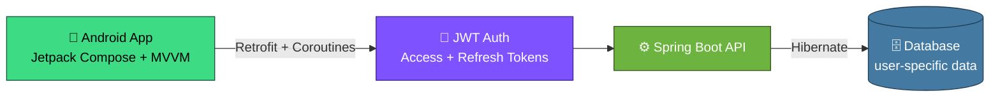

<!-- ═══════════════ HEADER ═══════════════ -->
<div align="center">


<a href="https://git.io/typing-svg">
  
</a>

<br/>


</div>

<br/>

<!-- ═══════════════ ABOUT ═══════════════ -->
## 🧠 About Me

<table>
<tr>
<td width="60%">

```kotlin
val abhishek = Developer(
    name      = "Abhishek Raj",
    role      = "Full Stack Developer",
    android   = listOf("Jetpack Compose", "MVVM", "Retrofit", "Coroutines"),
    backend   = listOf("Spring Boot", "JWT Security", "Hibernate"),
    exploring = "AI-powered developer tools",
    focus     = "Scalable + production-ready systems",
    motto     = "I build things that solve real problems."
)
```

</td>
<td width="40%">

- 🔭 Building **real-world full-stack apps**
- 📱 Android → **Jetpack Compose + MVVM**
- ⚙️ Backend → **Spring Boot + JWT**
- 🤖 Exploring **AI dev tools**
- 🎯 Shipping **usable** projects

</td>
</tr>
</table>

<!-- ═══════════════ TECH STACK ═══════════════ -->
## 💻 Tech Stack

<div align="center">

**🚀 Languages**


**⚙️ Backend**


<br/>


**📱 Android**


<br/>


**🗄️ Databases**


**🛠️ Tools**


</div>

<!-- ═══════════════ PROJECTS ═══════════════ -->
## 🚀 Featured Projects

### 📱 Item Tracker App &nbsp;   

- 🔐 Secure login with **Access & Refresh Tokens**
- 📊 Track categories like **Milk, Grocery, Products, Custom**
- 🧠 Built using **MVVM + Retrofit + Coroutines**
- ☁️ Spring Boot backend with **user-specific data isolation**



<br/>

<table>
<tr>
<td width="50%" valign="top">

### 🧾 Attendance Management App


- 📅 Manage daily attendance records efficiently
- 📊 Track presence/absence with structured data
- 🧠 Clean UI with organized data handling

</td>
<td width="50%" valign="top">

### 📅 Schedule Generator


- ⚙️ Generates optimized schedules automatically
- 🧠 Applies logic-based rules for conflict handling
- 📊 Useful for managing structured time slots

</td>
</tr>
</table>

### 🔍 Project Analyzer &nbsp; 

- 🧠 Analyzes **code dependencies & structure**
- 📊 Visualizes relationships between classes & methods
- ⚡ Helps in understanding large codebases
- 🚀 Focused on **developer productivity & insights**

<!-- ═══════════════ DIFFERENT ═══════════════ -->
## 🧩 What Makes Me Different

<div align="center">

| 🧠 Systems Thinker | 🔐 Security First | 📱 End-to-End | ⚡ Practical |
|:---:|:---:|:---:|:---:|
| I don't just build apps — I design **systems** | Strong focus on **JWT & auth flows** | Experience in **full app development** | I build projects that are **actually usable** |

</div>

<!-- ═══════════════ STATS ═══════════════ -->
## 📊 GitHub Insights

<div align="center">


<br/>


<br/>


<br/>


</div>

<!-- ═══════════════ FOCUS ═══════════════ -->
## ⚡ Current Focus

<div align="center">

| 🔥 Now | 🤖 Exploring | 🚀 Next |
|:---:|:---:|:---:|
| Scaling my **Project Analyzer** | Building **AI-powered developer tools** | **Actively searching for jobs** fitting my role |

</div>

<!-- ═══════════════ CONNECT ═══════════════ -->
## 🌐 Connect With Me

<div align="center">

<a href="mailto:abhishekr12j@gmail.com"></a>
<a href="https://instagram.com/_om_8405"></a>
<a href="https://github.com/Abhi-4825"></a>

<br/><br/>


</div>


